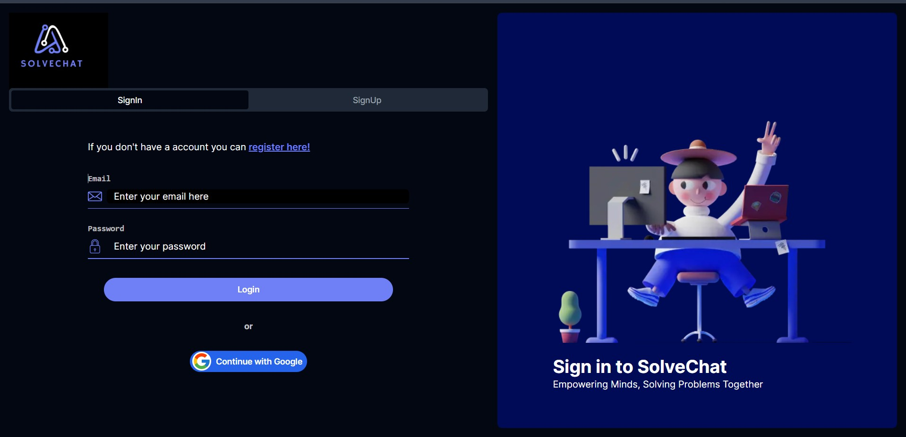
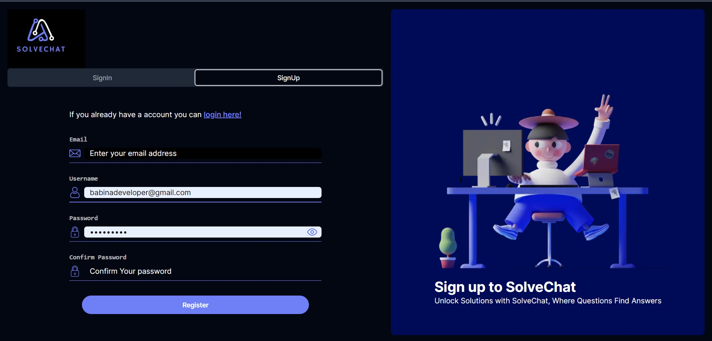
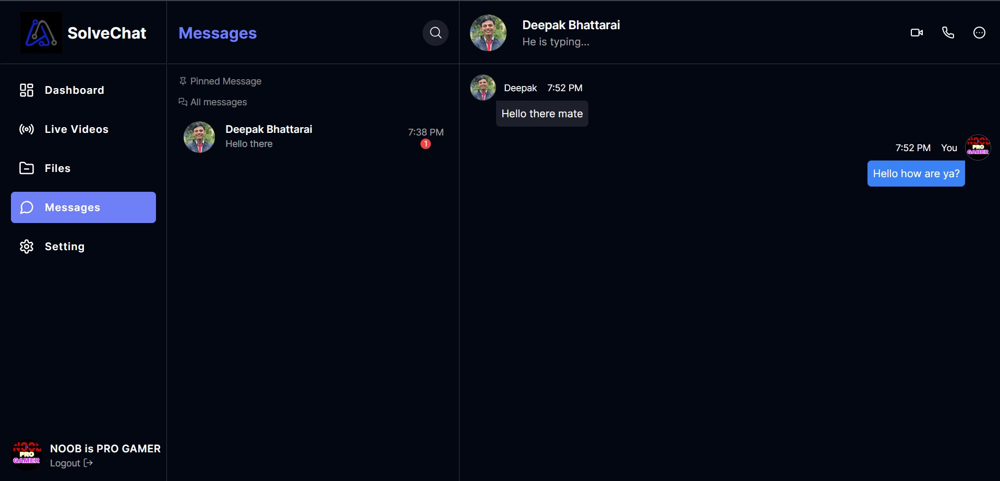

# Chat App

This is a work-in-progress (WIP) chat application built with Next.js, shadcn/ui, NextAuth, and Firebase backend. The application supports chat functionality and video calls. It includes authentication features with NextAuth, enabling users to log in using their Google accounts.

## Features

- **Chat:** Engage in real-time text-based conversations with other users.
- **Video Call:** Initiate video calls with friends and colleagues.
- **Authentication:** Securely log in using your Google account.

## Technologies Used

- [Next.js](https://nextjs.org/): A React framework for building server-side rendered and static web applications.
- [Shards UI](https://designrevision.com/): A modern UI toolkit for web applications based on Bootstrap.
- [NextAuth](https://next-auth.js.org/): Authentication library for Next.js applications.
- [Firebase](https://firebase.google.com/): A cloud-based platform for building web and mobile applications.

## Here are some of its images

